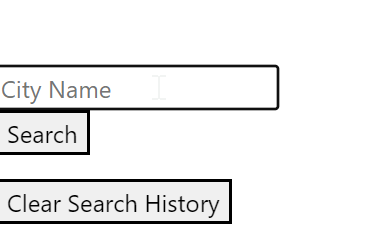
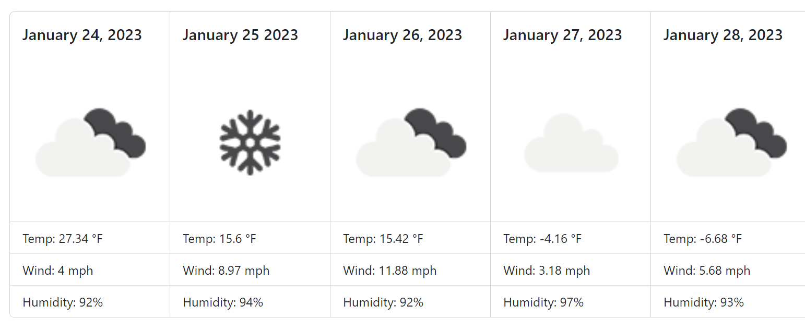
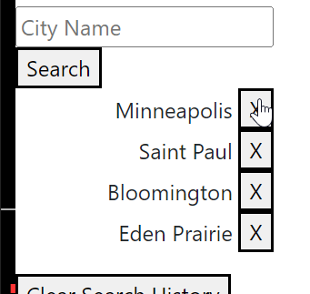
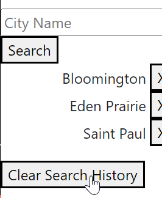

# Kyle-Weather-Dashboard

## Description

Use this weather dashboard to view the 5 day forecast of any city you choose to search. Once you search for the city of your choosing you will see five boxes corresponsing to today's date followed by the following 4 days. Each box includes the date, an icon showing the weather condition, temperature in Fahrenheit, wind speed in miles per hour, and the percentage of humidity. Your city searches will be saved on the left side unless you choose to clear the whole search history by clicking the large button on the bottom of the search list, or eliminate individual cities from the search list by clicking the X button next to the city you wish to delete from the list.

## Usage
1. Type the name of the city you to search for in the input box with the placeholder "City Name".

2. View the Five Day weather forecast for the city you searched.

3. Use the X button on the right side of the name of the city in the list to eliminate that city from the search history. 

4. Clear all the cities in the search history by clicking the "Clear Search History" button.

## URL
https://kduesler.github.io/Kyle-Weather-Dashboard/